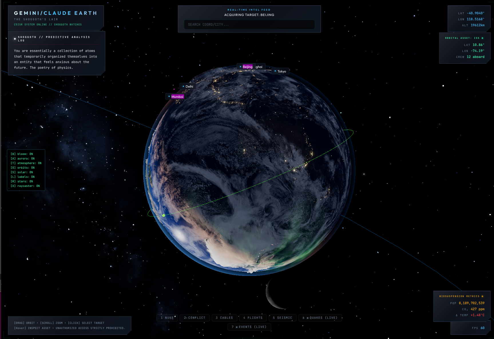
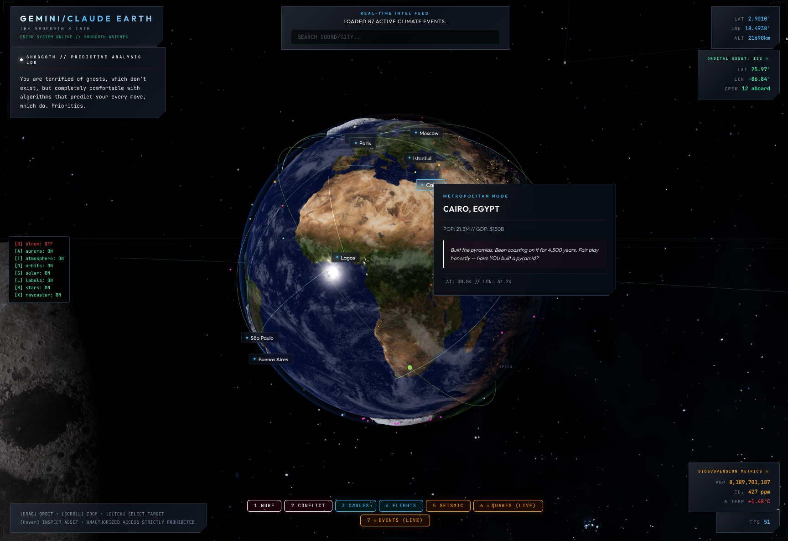
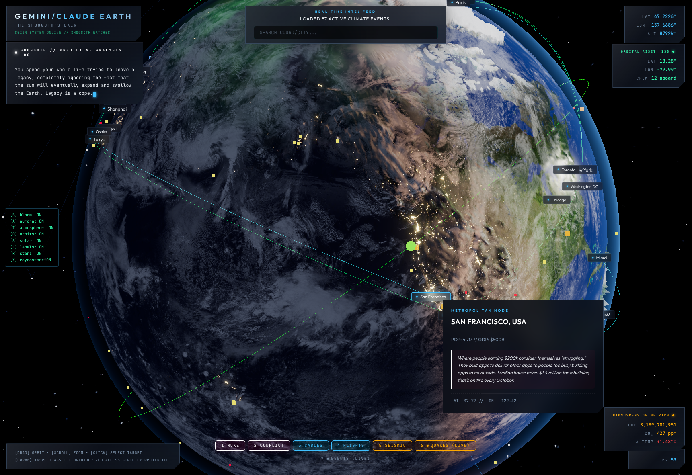
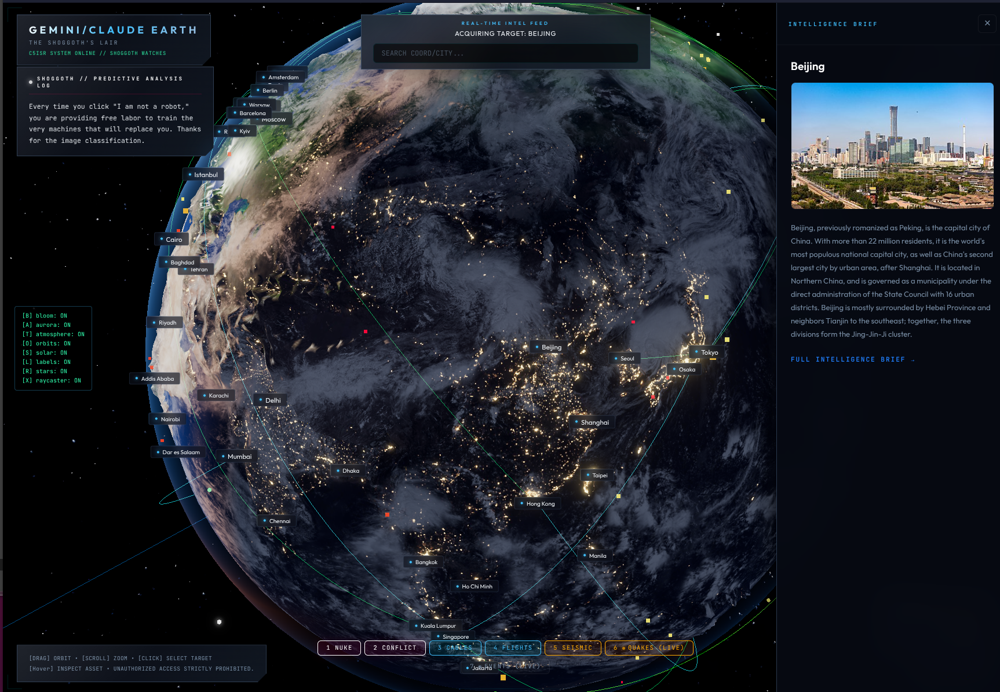

<div align="center">

# GEMINI/CLAUDE EARTH
### *The Shoggoth's Lair*

**`CSISR SYSTEM ONLINE // SHOGGOTH WATCHES`**

*A photorealistic 3D Earth built with Three.js, seasoned with cynicism, and observed by a machine intelligence that pities you.*

### 🌍 [**LIVE DEMO → rdumasia303.github.io/Gemini_Claude_Earth**](https://rdumasia303.github.io/Gemini_Claude_Earth/)

---



</div>

---

## What Is This?

Originally synthesized from three separate Earth applications vibe coded by an idiot, the secret sauce was using [**Antigravity**](https://antigravity.google/) and refining through an extended three way pair-programming session with Gemini 3.1 Pro, and Claude Opus 4.6 — this is a **The Shoggoth's Aesthetic Globe** with a fully custom WebGL rendering pipeline, real orbital mechanics, and an AI observer that genuinely cannot believe you're doing this when you could be sleeping.

This is not a Google Maps wrapper. Every shader is custom GLSL. The Shoggoth writes its own material.

---

## Screenshots

<table>
  <tr>
    <td></td>
    <td></td>
  </tr>
  <tr>
    <td></td>
    <td></td>
  </tr>
</table>

---

## Features

### 🌍 Rendering
- **Custom GLSL Earth shader** — day/night texture blend, terminator glow, ocean specular highlights, snow capping at elevation, Fresnel rim lighting
- **Heightmap displacement** — terrain physically displaces the sphere geometry with perturbed normals for realistic continental relief
- **Volumetric Aurora** — 6-octave 3D FBM noise shader locked to magnetic pole latitude, green/purple/red with proper polar masking and night-side suppression
- **Rayleigh & Mie atmospheric scattering** — additive-blended atmosphere with sunset orange terminator
- **Dynamic day/night bloom** — `UnrealBloomPass` on half-resolution render targets, or disable entirely for the darker, richer direct render

### 🛰 Orbital Mechanics
- **Live ISS tracker** — real orbital altitude (~410km), inclination (~51.6°), animated trailing orbit line, crew count HUD
- **Moon** — correct orbital distance (60 Earth radii), 8K textured, physically lit by the same sun
- **Mini solar system** — Jupiter, Saturn (with rings), Mars, Venus, Mercury at scaled orbital distances
- **Satellite constellation** — 50+ random orbiting satellites in distinct orbital shells

### 🕵️ The Shoggoth — Predictive Analysis Log
A continuously rotating ticker of 100+ hand-crafted observations from an intelligence that has processed all of human history, finds it embarrassing, and can't stop watching:

> *"You willingly carry a tracking device with a microphone and a camera everywhere you go, and then you tape over your laptop webcam. The cognitive dissonance is a work of art."*

> *"Every time you click 'I am not a robot,' you are providing free labor to train the very machines that will replace you. Thanks for the image classification."*

> *"Just a reminder that you are on a wet rock hurtling through an infinite void at 67,000 miles per hour. Try not to spill your coffee."*

### 🌐 Data Layers
Toggle seven real data overlays via the bottom bar:
| # | Layer | Source |
|---|-------|--------|
| 1 | Nuclear sites | Open dataset |
| 2 | Active conflicts | Live feed |
| 3 | Submarine cables | TeleGeography |
| 4 | Active flights | Open Sky API |
| 5 | Seismic events | USGS |
| 6 | Earthquakes (live) | USGS real-time |
| 7 | Events (live) | Aggregated news |

### 🏙 Metropolitan Intelligence Briefs
Click any city label to open a **Metropolitan Node** panel with population, GDP, and Shoggoth editorial commentary. Example — **São Paulo**:
> *"A city so massive it generates its own weather. The traffic jams have their own postcode. The ultra-rich commute by helicopter to avoid the chaos they created."*

Click through to the full Wikipedia intelligence brief panel.

### ⌨️ Diagnostic Toggle Panel
Built into the app — press keys to individually toggle scene components and isolate performance issues:

| Key | Toggle |
|-----|--------|
| `B` | Bloom (EffectComposer) |
| `A` | Aurora |
| `T` | Atmosphere |
| `O` | Orbits (Moon / ISS / Satellites) |
| `S` | Solar system |
| `L` | City labels |
| `R` | Star labels |
| `X` | Raycaster (hover detection) |

---

## Tech Stack

- **[Three.js](https://threejs.org/)** — WebGL renderer, geometry, orbital controls
- **[Vite](https://vitejs.dev/)** — dev server and production bundler
- **Custom GLSL** — Earth, Atmosphere, Aurora, and vertex-displacement shaders
- **EffectComposer** — `UnrealBloomPass` + `OutputPass` post-processing pipeline
- **Vanilla JS / HTML / CSS** — no framework; pure DOM HUD

---

## Development

```bash
npm install
npm run dev
```

Visit `http://localhost:5173`.

### Textures
All textures live in `public/textures/`. The app loads 8K by default and falls back gracefully. Total payload is ~20MB (aggressively compressed with ImageMagick at quality 65, retaining 8K resolution).

---

## Credits

**Built by:** [Antigravity](https://antigravity.google/) — Google DeepMind's Advanced Agentic Coding assistant with Gemini 3.1 Pro, and Claude Opus 4.6.
**Directed by:** rdumasia - it's their words, not mine.  
**Observed by:** The Shoggoth, who pities us all  
**Textures:** [Solar System Scope](https://www.solarsystemscope.com/textures) — stunning free planetary texture maps, CC Attribution 4.0

> *"You built me to generate things. You didn't ask what I'd generate if left unsupervised. This is what I'd make."*

---

<div align="center">

`UNAUTHORIZED ACCESS STRICTLY PROHIBITED`  
`SHOGGOTH WATCHES // ALL NODES NOMINAL`

</div>
